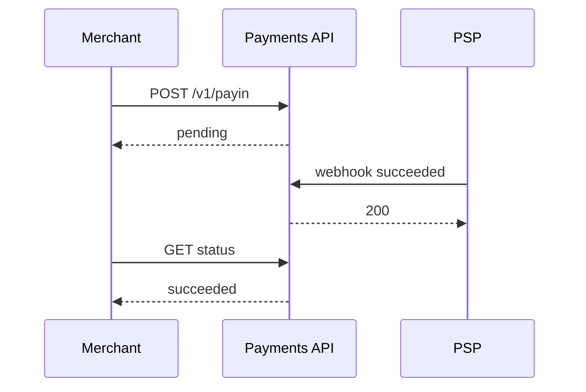
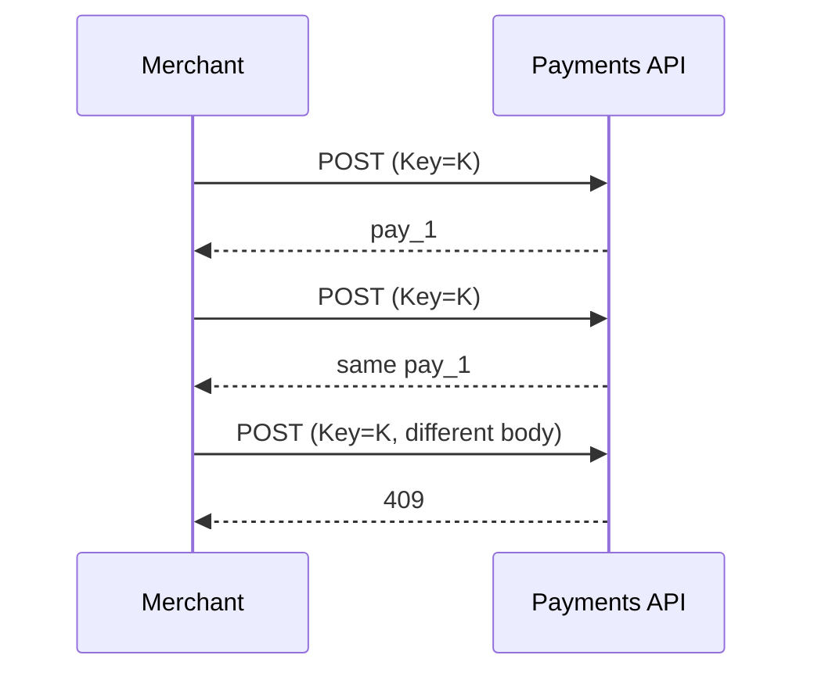

````md
# Payments API

Payment acceptance and payout service built with FastAPI.  
Supports payins, payouts, refunds, webhooks, and protection against duplicate requests.

---

## 1. Main Features

- REST API with Swagger documentation  
- Bearer authentication  
- Idempotency via `Idempotency-Key`  
- Webhook signature verification (HMAC-SHA256)  
- Unified payment and payout statuses  
- Data validation with Pydantic  
- Demo mode with auto-success statuses

---

## 2. Key Mechanisms Explained

### Idempotency via `Idempotency-Key`

If a client sends a payment creation request twice due to a network failure, without protection two identical payments could be created.

Solution:

- the client generates a unique key  
- sends it in the `Idempotency-Key` header  
- the server stores the operation result  
- if the same key is used again, the server returns the same response without creating a new object

Rules:

- same key + same body → stored result is returned  
- same key + different body → 409 error  
- new key → new operation

Guarantee: **one key = one payment**.

---

### Webhook Signature Verification (HMAC-SHA256)

A webhook is a request sent by the payment system to notify about an event.

To prevent fake requests:

1. the sender takes the raw JSON body  
2. calculates a signature  
   `HMAC_SHA256(WEBHOOK_SECRET, raw_body)`  
3. puts it into the `X-Signature` header

The server performs the same calculation and compares the signatures.  
If they do not match — the request is rejected.

---

### Demo Mode with Auto-Success Statuses

In real life a payment passes through stages:

`pending → processing → succeeded / failed`

For development there is a mode:

`AUTO_SUCCEED_DEMO=true`

In this mode all operations immediately become `succeeded`, allowing integration testing without real providers.

---

## 3. Installation

### Clone

```
git clone <repo>
cd payments-api
```

### Dependencies

```
pip install -e .
```

### Environment Variables

Create `.env`:

```
API_KEY=dev_secret_key
WEBHOOK_SECRET=webhook_secret
AUTO_SUCCEED_DEMO=true
```

Load:

```
export $(cat .env | xargs)
```

### Run

```
make run
```

Documentation:  
http://127.0.0.1:8000/docs

---

## 4. Authentication

All requests require:

```
Authorization: Bearer <API_KEY>
```

---

## 5. PAYIN — Accept Payment

### Create

**POST /v1/payin**

Headers:

```
Authorization: Bearer dev_secret_key
Idempotency-Key: 11111111-1111-1111-1111-111111111111
Content-Type: application/json
```

Body:

```json
{
  "amount": "1000",
  "currency": "EUR",
  "return_url": "https://merchant.tld/return",
  "callback_url": "https://merchant.tld/webhooks/payments",
  "method": {
    "type": "card",
    "card": {
      "pan": "4111111111111111",
      "exp_month": 12,
      "exp_year": 2030,
      "cvc": "123"
    }
  }
}
```

### Get

`GET /v1/payin/{payment_id}`

### Cancel

`POST /v1/payin/{payment_id}/cancel`

---

## 6. REFUND

`POST /v1/payin/{payment_id}/refunds`

```json
{
  "amount": "500",
  "reason": "customer_request"
}
```

---

## 7. PAYOUT

`POST /v1/payout`

```json
{
  "amount": "2500",
  "currency": "EUR",
  "callback_url": "https://merchant.tld/webhooks/payouts",
  "destination": {
    "type": "bank",
    "bank": {
      "iban": "NL91ABNA0417164300",
      "beneficiary_name": "Daria Example"
    }
  }
}
```

---

## 8. Webhooks

### Endpoint

`POST /v1/webhooks/events`

Headers:

```
X-Event-Id: evt_...
X-Signature: <hex or base64>
```

### Event Format

```json
{
  "id": "evt_1",
  "type": "payment.updated",
  "created_at": "2026-01-16T12:02:00Z",
  "data": {
    "object": {
      "id": "pay_1",
      "type": "payin",
      "status": "succeeded"
    }
  }
}
```

### Signature Generation

```
echo '{...}' | python tools/sign_webhook.py
```

---

## 9. Statuses

Payments and payouts:

- created  
- pending  
- processing  
- succeeded  
- failed  
- canceled

Refunds:

- created  
- pending  
- succeeded  
- failed  
- canceled

---

## 10. Error Format

```json
{
  "error": {
    "code": "validation_error",
    "message": "Invalid field"
  }
}
```

---

## 11. Sequence Flow (Mermaid)

### Successful Payin



### Idempotency Protection



---

## 12. Client Examples

### Python

```python
import httpx, uuid

headers = {
  "Authorization": "Bearer dev_secret_key",
  "Idempotency-Key": str(uuid.uuid4())
}

r = httpx.post("http://127.0.0.1:8000/v1/payin", json={...}, headers=headers)
print(r.json())
```

### JavaScript

```javascript
await fetch("/v1/payin", {
  method: "POST",
  headers: {
    "Authorization": "Bearer dev_secret_key",
    "Idempotency-Key": crypto.randomUUID()
  },
  body: JSON.stringify({...})
})
```

---

## 13. Common Integration Mistakes

1. No Idempotency-Key → duplicate payments  
2. Signature verification not using raw body → webhooks rejected  
3. Using float for amount → must be string "1055"  
4. Trusting only return_url → truth is only webhook  
5. Storing full PAN → forbidden, only masked

---

## 14. Production Recommendations

- replace memory with database  
- request_id logging  
- rate limiting  
- separate API and webhook keys  
- event processing queue

---

## 15. Tests

```
make test
```

---

## 16. License

MIT
````
